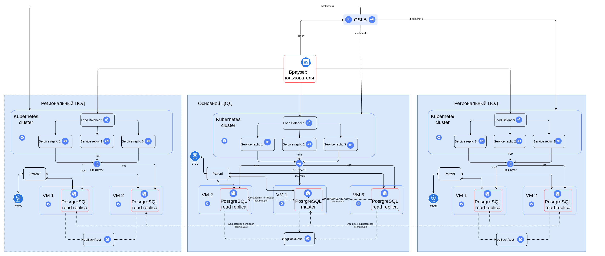

# Задача 1. Проект новой архитектуры

## Требования

1. Обслуживание пользователей из всех регионов РФ (все часовые пояса).
2. Компания хочет сделать упор на развитие в регионах РФ.
3. Бесперебойная работа сервиса 24/7.
4. RTO — 45 мин.
5. RPO — 15 мин.
6. Доступность ≥ 99,9%.
7. Одинаковое время загрузки страниц для пользователей из разных регионов.
8. Ожидается существенный прирост пользователей.
9. Размер данных ≥ 50Gb.

## Диаграмма контейнеров

  

## Обоснование выбора

Предлагаемая архитектура основана на Kubernetes и его механизмах так как:
- развертывание системы уже осуществляется с его использованием,
- это подходящий инструмент для достижения поставленных целей.

### Развертывание

Будет осуществляться в нескольких ЦОД-ах, в разных регионах РФ, в каждом - свой кластера K8s.
В требованиях сказано:
- "Одинаковое время загрузки страниц для пользователей из разных регионов",
- "Компания хочет сделать упор на развитие в регионах РФ".

С точки зрения физики логичным выглядит размещение главного узла ближе к географическому центру РФ (наименьшая средняя latency для пользователей из всех регионов). Однако есть ряд факторов в пользу другого варианта:
- Магистральные каналы связи в России в основном построены по принципу "звезда" с центром в Москве.
- Из Москвы прямые и самые быстрые каналы есть до любого миллионника. Между регионами (например, Екатеринбург — Хабаровск) связь часто хуже, чем Регион — Москва.
- В Москве проще найти несколько независимых площадок для обеспечения 99,9% доступности.
- В случае аварии у магистрального провайдера в Москве всегда есть 5-10 альтернативных маршрутов. В Сибири связность обеспечивают 2-3 ключевых игрока.

**На текущий момент выбран центральный узел - Москва.**

Однако в будущем можно рассмотреть возможность пересмотра этой стратегии в зависимости от региона-лидера по числу пользователей. Кроме того есть шанс минимизировать издержки за счет более дешевой электроэнергии в Сибири.

Выбран вариант развертывания отдельных кластеров K8s в каждом регионе так как один геораспределенный кластер потребует больше усилий по настройке эффективного взаимодействия между его сущностями (сервисы, поды и другие).

### Стратегия масштабирования

Среди механизмов масштабирования K8s выбраны:
- Horizontal Pod Autoscaler - задержки вызваны количеством запросов (RPS), а не наличием cpu-bound задач (Response Time).
- Cluster Autoscaler - позволяет предусмотреть выход за лимиты одной ноды.

Данной сочетание является рекомендованным вариантом использования, подходящим для текущей ситуации (ожидаемое увеличение количества пользователей).

Такая комбинация позволяет выполнять требования к:
- производительности (за счет параллельной обработки);
- отказоустойчивости (за счет наличия динамического изменения количества ресурсов: поды и ноды).

### Балансировка нагрузки

Балансировка будет осуществляться на нескольких уровнях:
- Внешний с использованием GSLB для определение наиболее подходящего ЦОДа (c точки зрения Response Time);
- Балансировка в рамках кластера K8s: LoadBalancer контролирует состояние подов с сервисами приложения ( при помощи healthcheck)
- Балансировка в рамках HA Postgresql кластера на базе Patroni с использованием HA Proxy, который контролирует состояние реплик и производит переназначение мастера при необходимости.

Такая стратегия позволяет выполнять требования:
- производительности за счет:
    - выбора самого близкого ЦОДа;
    - параллельной обработки разными репликами;
- отказоустойчивости за счет: 
    - равномерной нагрузки на реплики;
    - перераспределение ролей и нагрузки при авариях.

### Фейловер-стратегия

Нам подойдет лишь Active-Active так как:
- использование GSLB подразумевает активность всех точек развертывания;
- рекомендована для требований к доступности ≥ 99,5% (требуется ≥ 99,9%).

### Конфигурация БД

Для геораспределенной системы понадобится геораспределенный кластер Postgresql. Будем использовать Patroni как хорошо зарекомендовавший себя инструмент создания HA-кластеров.

Требования и приоритеты:
- одинаковое время загрузки страниц для пользователей из разных регионов,
- обслуживание пользователей из всех регионов РФ (все часовые пояса),
- компания хочет сделать упор на развитие в регионах РФ.

Есть 4 решения:
1. Один центральный узел в главном ЦОДе с репликой для чтения/записи и двумя для чтения (Single master).
2. Мультимастерная схема в Postgresql: в каждом ЦОДе есть реплики на чтение и запись (MultimasterPG).
3. Шардирование (Sharding).
4. Мультимастерная схема в NewSQL (CockroachDB, YugabyteDB).

Выбор оказался сложным, потому приведу сравнительную таблицу.

| Решение | Home region read latency | Home region write latency | Cross region read latency | Cross region write latency | Сложность реализации |
|---|---|---|---|---|---|
| Single master | Низкая | Высокая | Низкая  | Высокая  | Низкая (стандартное решение) |
| MultimasterPG | Низкая | Низкая  | Низкая  | Низкая   | Высокая (не является общей практикой, нужно подбирать инструменты) |
| Sharding      | Низкая | Низкая  | Высокая | Высокая  | Средняя (стандартное решение) |
| NewSQL        | Низкая | Низкая  | Низкая  | Низкая   | Очень высокая (смены СУБД) |

Шардирование избыточно для тех объемов данных, которые сейчас имеет компания. Кроме того, есть проблема кросс-региональных запросов.  
Наиболее простым неблокирующим решением выглядит Single master-схема.  
Основной недостаток - большая задержка операций записи из-за необходимости отправлять запрос центральному узлу.
Рассмотрим его подробнее: latency из Владивостока в Москву не превосходит 130мс. Необходимо отправить запрос на запись и дождаться подтверждения (~260мс). Но помимо записи, нам необходимо, чтобы прошла репликация из центрального узла к региональному (ещё 130 мс). В итоге получаем, что сетевая latency составит:
- 260 мс для асинхронной репликации,
- 520 мс - для синхронной.

Выберем асинхронный вариант для экономии времени.

Для RPO 15 мин достаточно:
- стандартной потоковой асинхронной репликации (обычно лаг составляет < 1 сек);
- выполнения бэкапов каждые 15 минут при помощи pgBackRest.

Для RTO 45 мин необходим Patroni + etcd. Он обеспечит автоматический Failover: если мастер в Москве упадет, одна из реплик станет мастером за 1–2 минуты.

**Итог: схема с одним мастером в центральном ЦОДе и несколькими репликами в других с потоковой асинхронной репликацией между ними.**
