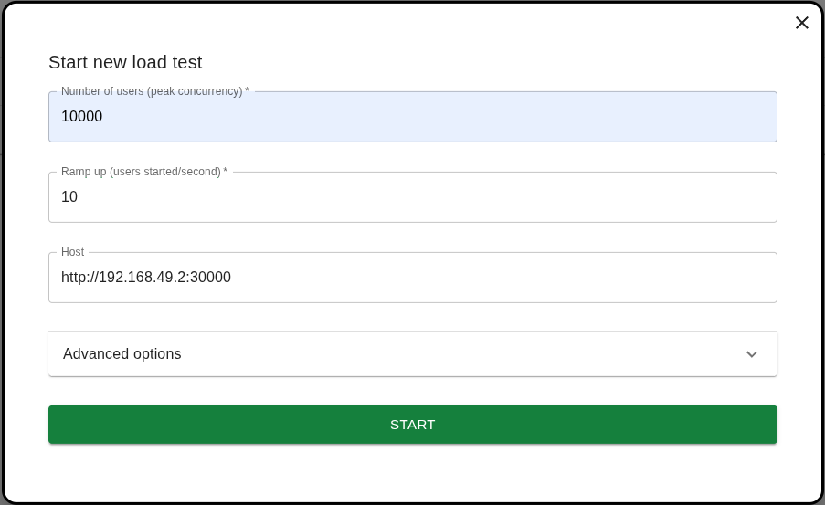
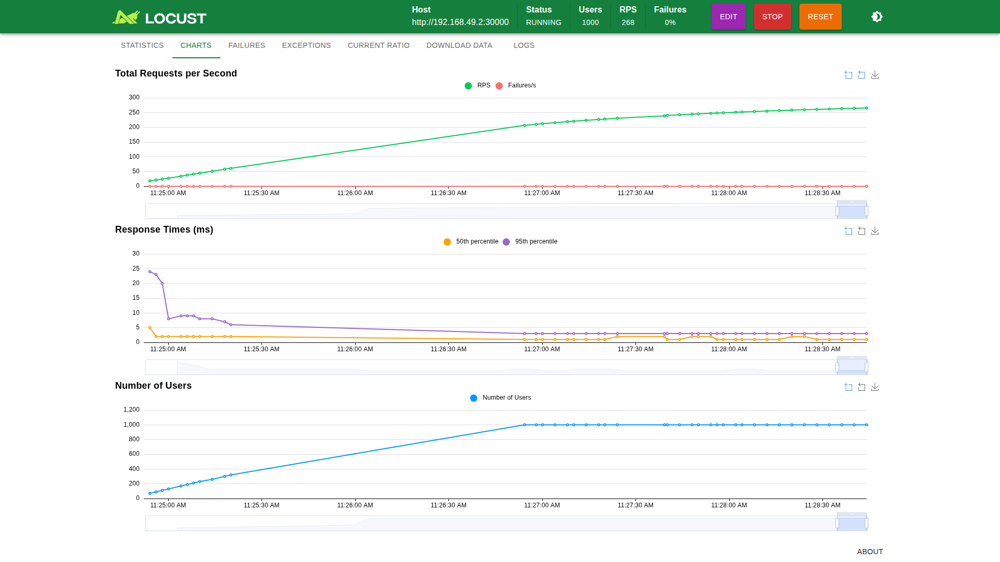
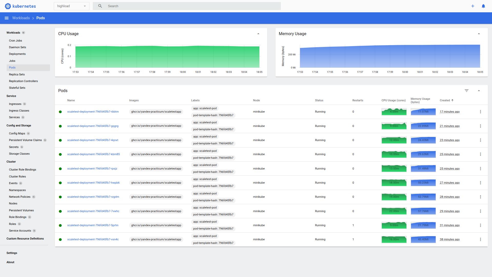
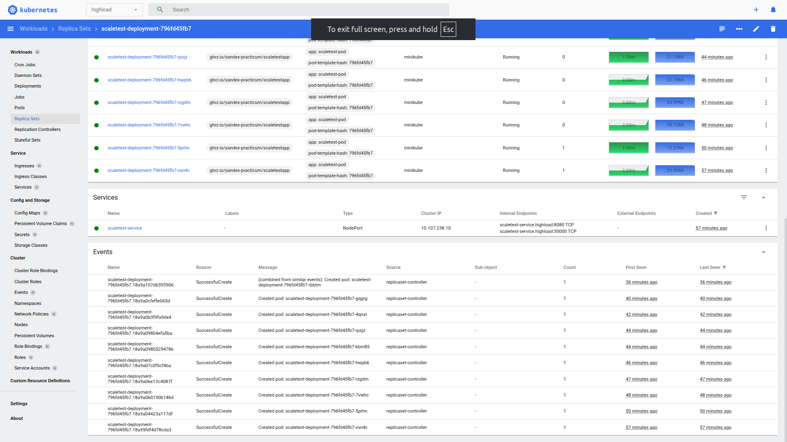
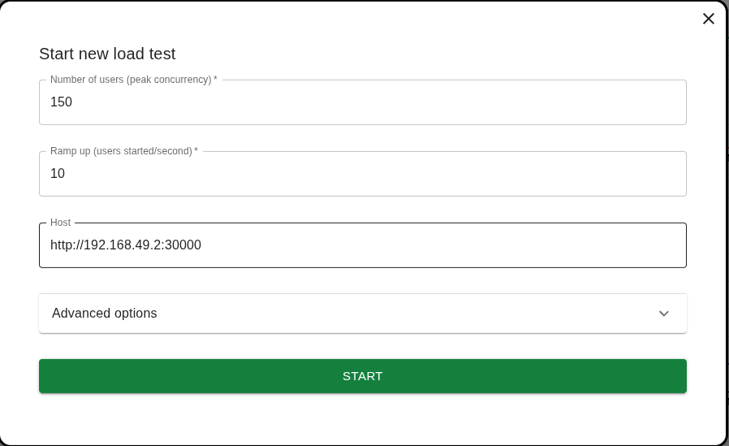
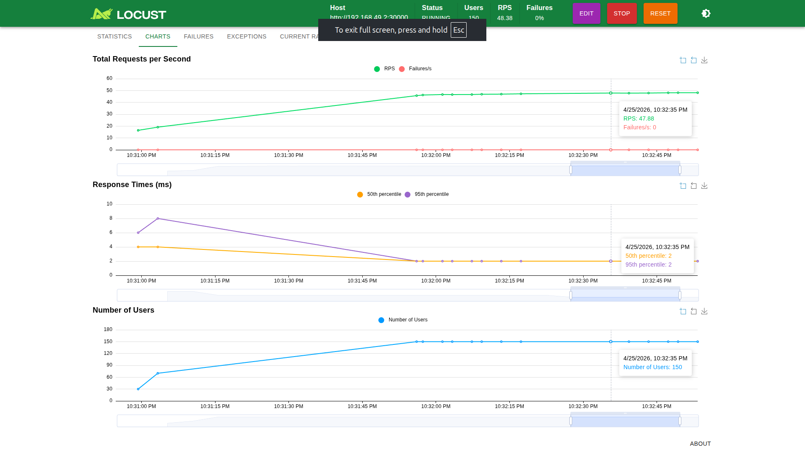
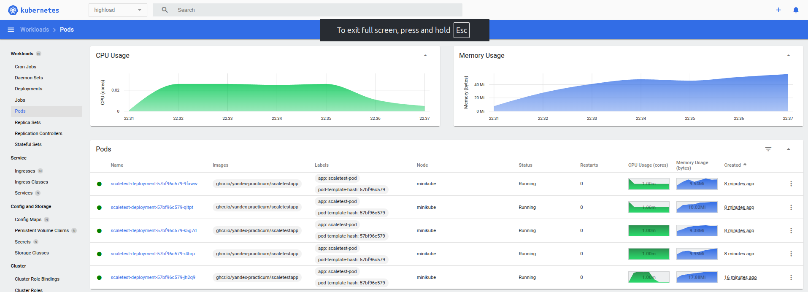
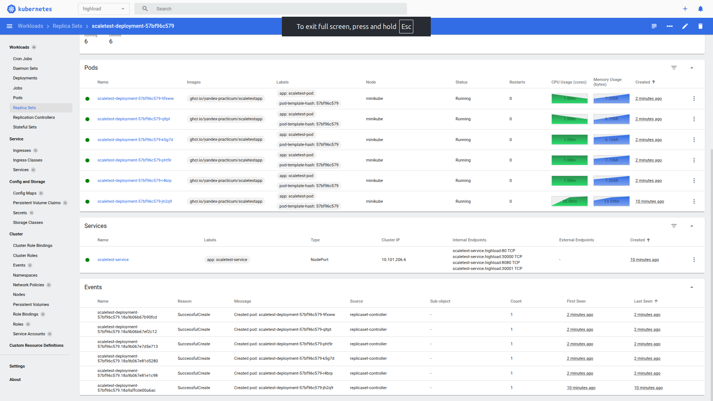

# Динамическое масштабирование контейнеров

## Динамическая маршрутизация на основании показателей утилизации памяти

**Запуска нагрузочного тестирования**

```bash
cd <project_dir>/task2/scripts
./run_minikube_hpa_memory.sh

source ../../.venv/bin/activate
locust -f ../locustfile.py
```

Тестирование проводилось с нижеприведенными параметрами. Эти значения позволяют:
- набирать нагрузку плавно, избегая OOM;
- достигать значений, при которых нужна репликация.



**Результаты**

Профиль нагрузки в locust:



На скриншоте ниже видно количество подов.



На скриншоте ниже, в секции Events, видны события создания подов.



В [папке](./logs/) представлены логи тестирования, в которых есть записи о работе HPA.
- [deployment.log](logs/deployment.log) -> ```kubectl describe hpa scaletest-hpa -n highload > ./task2/logs/hpa.log```
- [hpa.log](logs/hpa.log) -> ```kubectl describe deployment scaletest-deployment -n highload > ./task2/logs/deployment.log```


## Динамическая маршрутизация на основании показателей количества запросов в секунду

**Запуска нагрузочного тестирования**

```bash
cd <project_dir>/task2/scripts
./run_minikube_hpa_rps.sh

source ../../.venv/bin/activate
locust -f ../locustfile.py
```

Тестирование проводилось с нижеприведенными параметрами. Эти значения позволяют:
- набирать нагрузку плавно, избегая OOM;
- достигать значений, при которых нужна репликация.



**Результаты**

Профиль нагрузки в locust:



На скриншоте ниже видно количество подов.



На скриншоте ниже, в секции Events, видны события создания подов.



В [папке](./logs/) представлены логи тестирования, в которых есть записи о работе HPA.
- [rps_deployment.log](logs/rps_deployment.log) -> ```kubectl describe hpa scaletest-hpa -n highload > ./task2/logs/rps_hpa.log```
- [rps_hpa.log](logs/rps_hpa.log) -> ```kubectl describe deployment scaletest-deployment -n highload > ./task2/logs/rps_deployment.log```

Логи снимались после выключения нагрузки, потому зафиксировали downscaling.