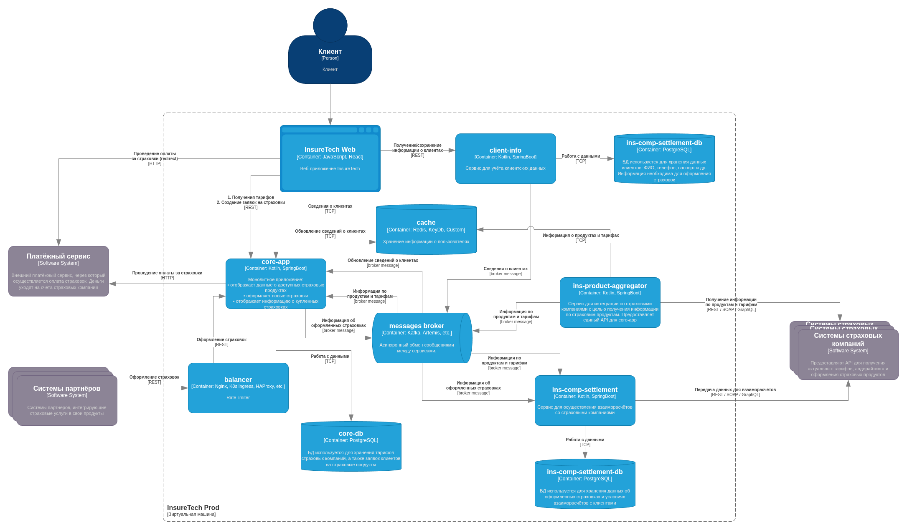

# Задача 3. Переход на Event-Driven архитектуру

## Проблемы

- При возрастании нагрузки сайт медленно загружает страницы или не загружает вообще.
- Нарушается SLA внешнего API для B2B-клиентов.
- Приложение падает под нагрузкой.
- Восстановление занимает часы так как команда узнает о падениях от пользователей.
- Задержки и ошибки при использовании API страховых компаний.

## Анализ use-case-ов в контексте вышеобозначенных проблем

1. Запрос списка продуктов пользователем (фронтенд -> core-app)
    - Данные для ответа реплицируются от API партнеров через ins-product-aggregator раз в 15 минут => не видно проблем.
2. Оформление страховки пользователем/партнером (фронтенд -> core-app)
    - Есть два синхронных запроса: в client-info и Платежный сервис => источник рисков при отказе/задержке любого из сервисов.
3. Получение информации об оформленных страховках (ins-comp-settlement -> core-app, один раз в сутки)
    - Запрос в core-db c объемным ответом (данные за сутки) => повышенный риск неактуальности данных в ins-comp-settlement в случае ошибки.
4. Получение/сохранение информации о клиентах (фронтенд -> client-info)
    - Стандартный синхронный запрос от frontend к backend с выборкой данных их БД => не видно проблем.
5. Запрос на получение информации о продуктах у сторонних систем страхования (core-app -> ins-product-aggregator, каждые 15 минут)
    - Риск неактуальности так как: "Иногда команда сталкивается с ошибками взаимодействия между этими сервисами", => данные могут быть не обновлены своевременно.
6. Запрос на получение информации о продуктах (ins-comp-settlement -> ins-product-aggregator, раз в сутки)
    - "Иногда команда сталкивается с ошибками взаимодействия между этими сервисами" => данные могут быть не обновлены своевременно.
7. Отправка данных для взаиморасчетов в страховые компании (ins-comp-settlement -> страховые компании, один раз в мес)
    - Объемная передача данных => риск неактуальности данных у партнеров в случае ошибок.
8. Нарушается SLA внешнего API для B2B-клиентов
    - Системы партнеров перегружают API => сервис отвечает медленно.

Значимыми проблемами, которые можно решить архитектурно, являются:
- Оформление страховки пользователем/партнером [2].
- Получение информации об оформленных страховках [3].
- Запрос на получение информации о продуктах у сторонних систем страхования [5,6].
- Системы партнеров перегружают API [8].

## Решения

### Оформление страховки пользователем/партнером

Проблема этой операции в двух синхронных запросах к внутреннему (client-info) и внешнему (Платежный) сервисам. Отказаться от второго не представляется возможным, а вот от первого можно - за счет реализации шаблона CQRS.

Для этого необходимо добавить в систему сервис кэширования (например Redis), который будет хранить информацию о пользователе, необходимую для оформления страховки. Кэш будет обновляться при получении событий user:changed и user:created (client-info -> core-app).

Данный подход подразумевает:
- добавление в систему брокера сообщений (Kafka, Artemis и другие) и логики работы с ним;
- реализацию Transactional Outbox для создания/изменения пользователя:
    - создать Outbox table в ins-comp-settlement-db,
    - создать фоновую задачу по её вычитыванию или развернуть CDC (например, Debezium);
- прогрев кэша при старте системы.

Плюсы:
- Повышение производительности оформления страховок за счет замены синхронного запроса в client-info на быстрое обращение к кэшу.
- Независим масштабирование операций обновления пользователей и оформления страховок.
- Ослабление связи между core-app и client-info.

Риски:
- Неконсистентность кэша в core-app и БД пользователей:
    - из-за задержки обновления - минимален так как данные пользователей меняются нечасто;
    - из-за падения client-info при записи сохранении изменений - решается реализацией Transactional Outbox.
- Утечки и повреждения кэширования данных:
    - строгое ограничение доступа к кэшу;
    - тщательный контроль предоставляемых данных, чтобы один пользователь не оплатил страховку другому;
    - шифрование чувствительной информации;
    - контроль сохранения кэша на диск сервера.

Минусы:
- Непростые доработки и усложнение системы.

**Итог: считаю, что плюсы перевешивают издержки, предложение вынесено на схему новой архитектуры.**

### Получение информации об оформленных страховках

Проблема этой операции в большом количестве передаваемых данных (все страховки за сутки). В случае ошибки информация либо потеряется, либо будет получена лишь через сутки. Предлагается использовать брокер сообщение, чтобы core-app уведомлял ins-comp-settlement о новых страховках.

Данный подход подразумевает:
- добавление в систему брокера сообщений (Kafka, Artemis и другие) и логики работы с ним;
- реализацию Transactional Outbox при оформлении страховки:
    - создать Outbox table в core-db,
    - создать фоновую задачу по её вычитыванию, либо развернуть CDC (например, Debezium)

Плюсы:
- Перераспределяем нагрузку на core-app за счет дробление одного большого запроса на мелкие уведомления.
- Ослабление связи между core-app и ins-comp-settlement.

Риски:
- Мы точно не знаем в какое именно время проводился запрос: "Дополнительно сервис ins-comp-settlement раз в сутки осуществляет запрос в core-app по REST API для получения всех оформленных за день страховок", - но было бы логично это делать ночью. Соответственно мы добавили создание событий в период активной работы системы. Для сведения рисков к минимуму необходимо использовать брокер с достаточной производительностью (точно Kafka, возможно Artemis).

Минусы:
- Непростые доработки и усложнение системы.

**Итог: считаю, что плюсы решения сомнительны, предложение не вынесено на схему.**

### Запрос на получение информации о продуктах у сторонних систем страхования

Проблемой этих операций в том, что: "Иногда команда сталкивается с ошибками взаимодействия между этими сервисами". Это ведет к отсутствию (или задержке получения) актуальных данных. Предлагается перенести периодический опрос систем страховых компаний в сервисе ins-product-aggregator с уведомлением всех заинтересованных через брокер сообщений. Опрос должен проводиться с частотой, соответствующей максимальной среди подписчиков (раз в 15 минут для core-app).

Данный подход подразумевает:
- добавление фоновой задачи периодического опроса в ins-product-aggregator;
- организацию повторных запросов и реакции на ошибки внешних API в ins-product-aggregator;
- кэширование ответов страховых компаний на случай их недоступности или восстановления самого ins-product-aggregator после падения;
- добавление в систему брокера сообщений (Kafka, Artemis и другие) и логики работы с ним.

Плюсы:
- Сосредоточение мер по борьбе "с задержками ответов или ошибками при взаимодействии с API страховых компаний" в рамках одного сервиса, вместо дублирования их в каждом потребителе данных.
- Уменьшение нагрузки на систему за счет уменьшения числа запросов к API страховых компаний.
- Ослабление связи core-app и ins-comp-settlement с ins-product-aggregator.

Минусы:
- Непростые доработки и усложнение системы.

**Итог: считаю, что плюсы перевешивают издержки, предложение вынесено на схему новой архитектуры.**

### Системы партнеров перегружают API

Проблема в том, что системы партнеров не контролируют нагрузку, не смотря на SLA. Значит необходимо сделать это самим. Предлагается стандартное решение для внешних API - реализация шаблона Rate limiter.

Данный подход подразумевает:
- реализацию Rate limiter на уровне балансировщика нагрузки.

Плюсы:
- Позволяет избежать влияния на прикладные компоненты приложения.
- Возможность гибкой настройки через конфигурационный файл балансировщика.

Риски:
- Необходимо перекрыть доступ к приложениям в обход балансировщика.

**Итог: минусов у решения практически нет, его обязательно нужно реализовать.**

## Диаграмма контейнеров TO BE

