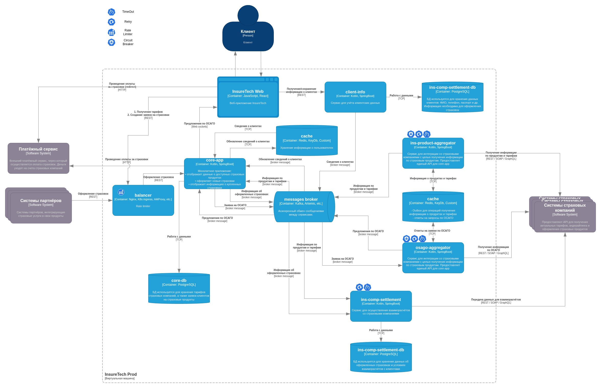

# Проектирование продажи ОСАГО

## Требования
- На экране пользователя предложения от каждой страховой компании отображаются сразу, как только от неё пришёл ответ.
- Максимальное время ожидания решения от страховой компании — 60 секунд.
- Сохранить подход получения данных о продуктах и тарифах из страховых компаний.
- Новый сервис osago-aggregator:
    - отправка заявок в страховые компании;
    - дальнейший опрос решений по ним для передачи результатов в core-app.
- Количество заявок на ОСАГО может достигать 2,5 тысячи единовременно.

## Osago-aggregator

Возьмёт на себя ответственность за опрос API страховых компаний.

С обработкой нештатных ситуаций:
- отсутствие ответа - Timeout + Exponential Retry;
- ошибка в ответе - Exponential Retry;
- возобновление опроса с места остановки в случае падения сервиса.

А также ответственностью за производительность:
- распараллеливание запросов - средствами языка и фреймворка.
- отправку ответа в канал передачи в момент получения без задержек.

Каждый ответ будет содержать сквозной идентификатор исходного запроса (osag_req_id).

## Интеграция core-app <-> osago-aggregator

Будет реализована на основе уже добавленного в систему брокера сообщений. Эта технология уже была интегрирован в систему на [прошлом шаге](../task3/README.md#оформление-страховки-пользователемпартнером).

Реализация подразумевает:
- отправку сообщения osago:request со стороны core-app в брокер;
- получение и обработку в osago-aggregator;
- отправку множественных сообщений osago:response с ответами (но одинаковым osag_req_id) от osago-aggregator в брокер;
- прием и группировка ответов в core-app.

Плюсы:
- Достаточная производительность за счет использования быстрого брокера.
- Отказоустойчивость "из коробки" (брокер сохранит сообщения до подтверждения обработки).
- Слабая связь между core-app и osago-aggregator.
- Возможность независимого масштабирования core-app и osago-aggregator.
- Не увеличивает число технологий в системе.
- История сообщений для отладки.

Риски:
- Задержка чуть выше чем могла бы быть при выборе других решений (например GRPC server stream).
- Ошибки сквозной передачи идентификатора исходного запроса (osag_req_id).

Минусы:
- Для достижения высокой производительности систему необходимо настроить (топики, партиции, гарантии обработки, политика хранения и другие).

В сравнении с GRPC server stream не нужно:
- вручную обрабатывать кейс потери соединения между сервисами,
- заботиться о синхронизации доступа сервисов к описанию API (protobuf),
- добавлять новую технологию.

Однако необходимо позаботиться о сквозной идентификации запросов. Кроме того выбранное решение имеет бОльшую задержку (из-за наличия очереди в брокере), чем прямое GRPC-соединение.

Текущее решение выглядит рациональным с точки зрения соотношения усилия/издержки, однако в случае нехватки производительности его можно будет заменить на GRPC server stream.

**Итог: данное решение выбрано как наиболее простое (с учетом прошлых задач).**

## Хранилище osago-aggregator

Сервису необходимо собственное хранилище из-за долгой обработки одной заявки на ОСАГО.
При обработке заявки отправляются несколько запросов к API страховых компаний.
Результаты получаются независимо друг от друга.
В случае падения сервиса до получения всех ответов необходимо сохранить промежуточные результаты.
Это позволит не начинать процесс с начала после перезапуска и не перегружать API партнеров.

Подразумевается, что исходное сообщение в брокере существует до подтверждения обработки (которого не будет в случае падения osago-aggregator).

В качестве хранилища будем использовать уже добавленный в систему [ранее](../task3/README.md#оформление-страховки-пользователемпартнером) cache. Его возможностей достаточно для сохранения полученных ответов.

## Интеграция core-app - frontend

В рассматриваемом сценарии предлагается реализовать Server-push взаимодействие.
Задержка получения ответа клиентом зависит от работы API систем страхования, у которых могут быть разные SLA.
Поэтому лучше сразу ответить на исходный запрос пользователя, оповестив его о приеме заявки в работу. А весь набор предложений дослать по мере поступления ответов.
Для реализации планируется использовать WebSockets.

Плюсы:
- Высокая производительность.
- Широкая поддержка браузерами.

Избыточность:
- Есть невостребованный двусторонний обмен - не критично так как не создает накладных расходов.

Риск:
- Блокировки в корпоративной среде - не слишком вероятный и точно не массовый сценарий использования.

Минусы:
- Нет встроенной поддержки переподключения в случае разрыва соединения - необходимо реализовать вручную.

В сравнении с SSE не имеет ограничений в росте и масштабировании (6 соединений, только UTF-8 данные).

Наличие избыточного функционала двусторонней связи не усложняет ни настройку, ни эксплуатацию, может служить точкой роста при необходимости.

**Итог: данное решение выбрано как удовлетворяющее критериям без видимых ограничений роста.**

## Использование паттернов отказоустойчивости

### Rate limiter

**core-app**

[Ранее](../task3/README.md#системы-партнеров-перегружают-api) мы уже использовали Rate limiter на уровне балансировщика для защиты core-app от перегрузки через API.

Но перегрузку могут вызвать не только вызовы публичного API, но и стандартный запросы пользователей. Поэтому здесь также необходимо использовать Rate limiter.

### Timeout + Retry + Circuit breaker

**osago-aggregator** и **ins-product-aggregator**

Также я уже отметил [необходимость](#osago-aggregator) использовать связку Timeout + Retry при обращении к API страховых компаний.
Это поможет не выдавать ошибку, если проблема краткосрочная.
Однако к ним также стоит добавить Circuit breaker, чтобы система не тратила ресурсы зря в случае долгосрочной проблемы на стороне страховых компаний.
Особенностью реализации в данном случае будет то, что Circuit breaker (как и Timeout + Retry) нужно сделать применительно к каждому стороннему сервису.
Страховые компании независимы и недоступность сервисов одной не означает недоступность остальных.

Всё вышесказанное относится и к ins-product-aggregator так как он работает по тому же принципу.

Пояснение взаимодействия шаблонов отказоустойчивости.

Чтобы совместное применение не выглядело как нагромождение, поясню взаимодействие шаблонов.

Шаблоны Timeout, Retry и Circuit breaker естественным образом дополняют друг друга и часто могут использоваться вместе. 
Рассмотрим пример. Отправляем запрос к сервису, как понять, что он не отвечает? Вышел таймаут. 
Что делать дальше? Попробовать повторить запрос, вдруг проблема краткосрочная? 
Не отвечает. Сколько раз так делать? Пока не выйдет лимит попыток, но надо учитывать риск DDoS, потому надо использовать Retry с возрастающим таймаутом. 
Вышел, что дальше? Отправляем пользователю ошибку и блокируем следующие запросы к сервису - Circuit Breaker. До тех пор, пока не пройдет его время ожидания. Потом попробуем отправить запрос снова. 

Таким образом Timeout + Retry помогают справляться с краткосрочными проблемами, не перегружая сервис, а Circuit breaker не дает потратить на это слишком много ресурсов.

 

**ins-comp-settlement**

В системе есть ещё один запрос к внешним API - передача данных для взаиморасчетов между ins-comp-settlement и страховыми компаниями.
Он происходит редко (1 раз в месяц), но в нем передается много данных, а его ошибка может привести к значительным бизнес-последствиям так как он связан с финансами.

Здесь необходимо применить Timeout и Retry. Причем повторные попытки можно делать через достаточно большие промежутки времени так как данные не потеряют актуальность ещё месяц.

Применение Circuit breaker в данном случае не требуется (так как запросы редки и предсказуемы).
Достаточно того, чтобы повторные запросы не были бесконечными.
В случае полного провала повторов необходимо автоматическое уведомление ответственных о сбое в работе.

## Диаграмма контейнеров TO BE

