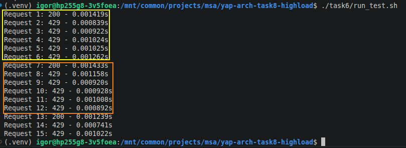

# Настройка Rate Limiting

Доработанный файл конфигурации Nginx представлен [тут](./nginx.conf).

```bash
cd <project_dir>

docker-compose -f task6/docker-compose.yaml up -d
./task6/run_test.sh
```

**Ожидаемый результат тестирования**

На скриншоте видны фиксированные окна rate-limiting-а.


